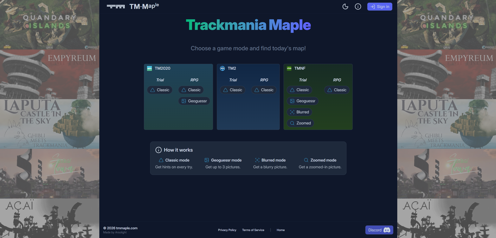
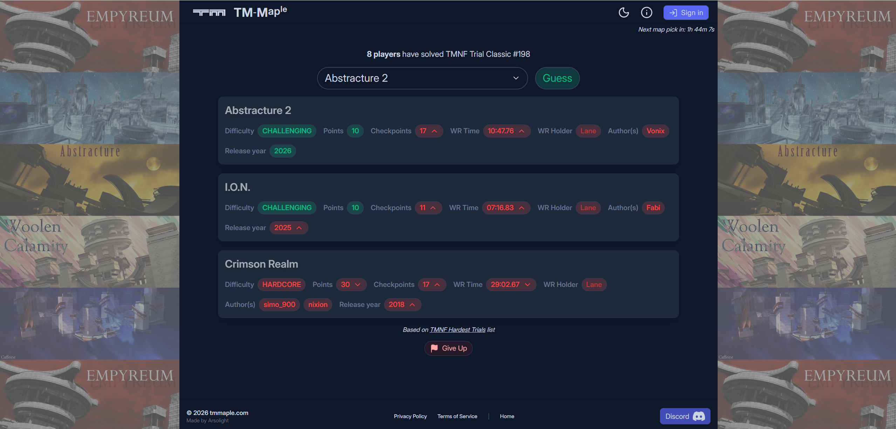
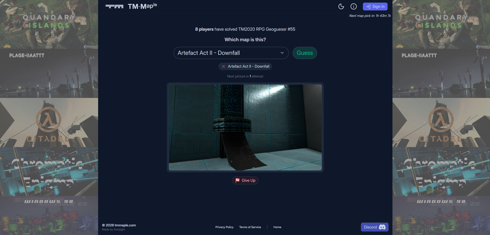
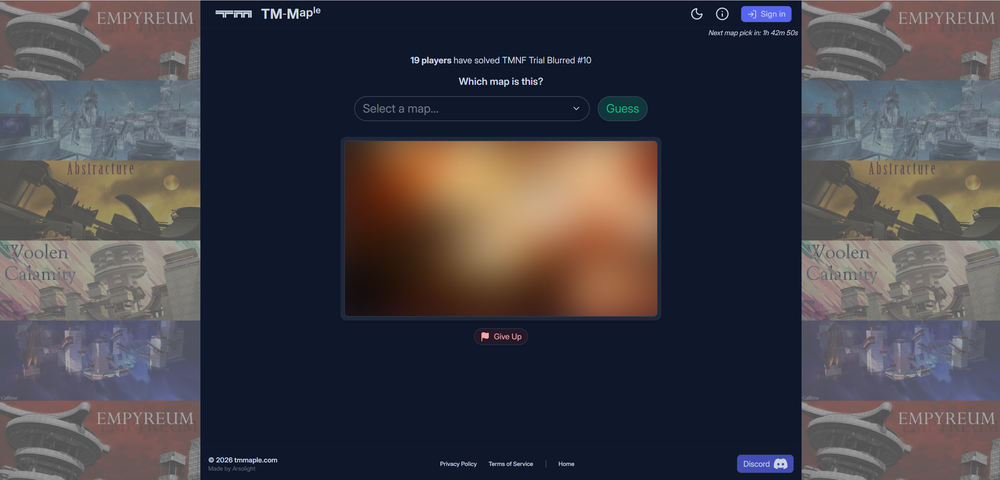
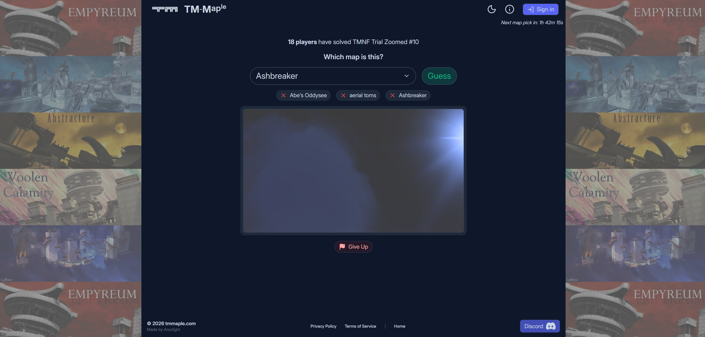
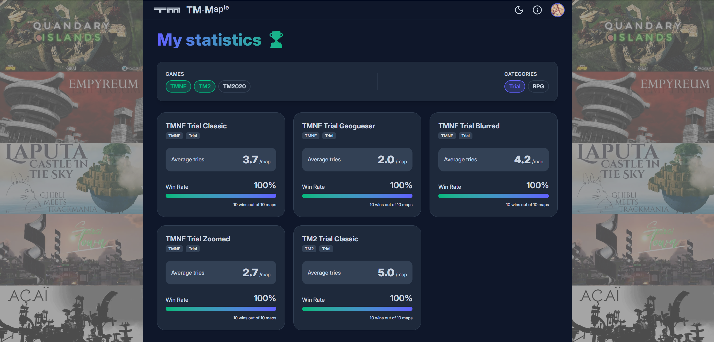

# TM-Maple

**TM-Maple is a daily guessing game** based on some Trackmania map lists such as [**TMNF Hardest Trials List**](https://tmrpgtrial.com/list/cm7z509dr0f91mph5e47sftz0) or [**TMNF Classic RPG List**](https://tmrpg.com/maps?game=tmnf&mode=classic).
Each day at 00:00 Franch time, a new map is selected for each game mode.  
Your goal: guess which map it is using progressively more precise hints!

See [**https://tmmaple.com**](https://tmmaple.com)

---

## How to Play

1. Pick a map from the list  
2. Click **Guess**  
3. Depending on the game mode you are playing, get more clues
4. Repeat until you find today’s map!

### Classic mode
Receive hints such as:
   - Whether the points are higher/lower  
   - Which authors match  
   - And more…  

### Geoguessr mode
Get up to 3 screenshots taken somewhere in the map...

### Blurred mode
Get a blurred picture that gets sharper with every guess.

### Zoomed mode
Get a zoomed-in picture that zooms out with every guess.

---
### Login
You can sign in with Discord to track your personal stats!

---

## Tech Stack

### Backend
- **Java 25**
- **Spring Boot 4**
- **MariaDB**
- REST API

### Frontend
- **Vue 3**
- **Vite**
- **Tailwind CSS v4**

---

## Backend Setup

### Install dependencies
- cd backend
- ./mvnw install

### Run the backend
- ./mvnw spring-boot:run

## Frontend Setup

### Install dependencies
- cd frontend
- nvm i
- nvm use
- npm i

### Run the frontend
- nvm use
- npm run dev
